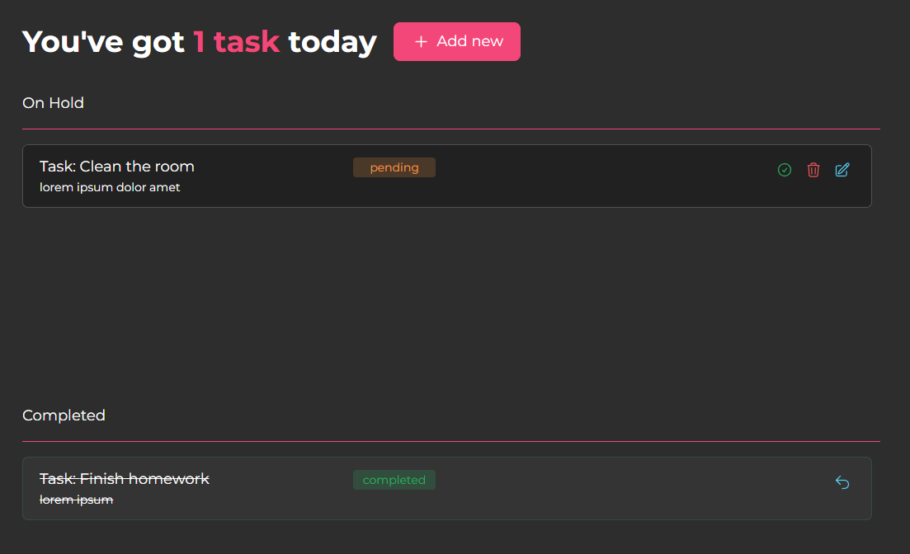

# Avalio Recruitment Task

To see a preview checkout the demo:

[Demo](https://0fc0c00c-570d-4118-ae44-e50693ce7fac.vercel.app/)



## Prerequisites

Make sure you have the following software installed on your machine:

- [Node.js](https://nodejs.org/) (v16 or higher)
- [Yarn](https://yarnpkg.com/)

## Getting Started

1. **Clone the Repository:**

   ```sh
   git clone git@github.com:toporek44/recruitment-frontend.git
   cd recruitment-frontend
   ```

   Install Dependencies:

   ```bash
   yarn install
   ```

   Running the Vite Project
   To run the Vite project locally, use the following command:

   ```bash
   yarn dev
   ```

This will start the development server. Open your browser and navigate to http://127.0.0.1:5173/ to view the project.

Running Tests
This project uses Jest for running tests. To execute the tests, use the following command:

```sh
yarn test
```

This command will run all the tests in the project and display the results in the terminal.

# React + TypeScript + Vite

This template provides a minimal setup to get React working in Vite with HMR and some ESLint rules.

Currently, two official plugins are available:

- [@vitejs/plugin-react](https://github.com/vitejs/vite-plugin-react/blob/main/packages/plugin-react/README.md) uses [Babel](https://babeljs.io/) for Fast Refresh
- [@vitejs/plugin-react-swc](https://github.com/vitejs/vite-plugin-react-swc) uses [SWC](https://swc.rs/) for Fast Refresh
